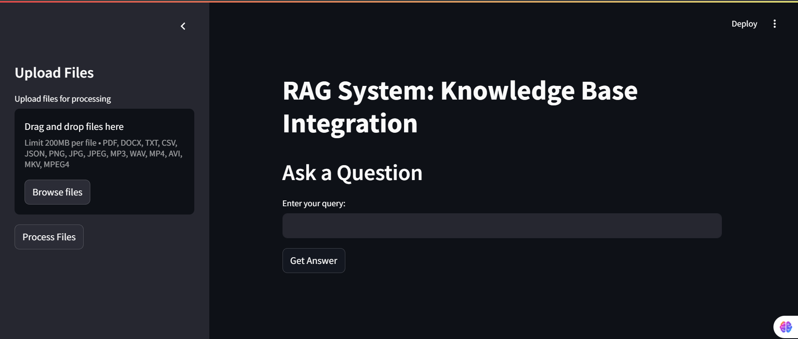
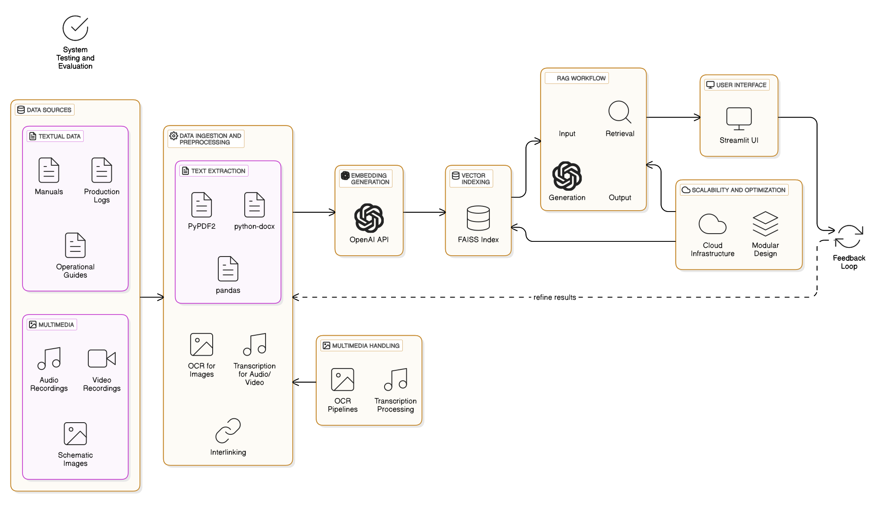

# ⚙️🧬🔐 RAG System for MES in Chemical Industry 🏭🔬📊

This repository contains the code and resources for building a **Retrieval-Augmented Generation (RAG)** system for a **Manufacturing Execution System (MES)** in the chemical industry.

## **Table of Contents 📖 🔬**
# RAG System Knowledge Base Integration

Here are some images for the system:


- [1. Features](#1-features-)
- [2. Technologies Used](#2-technologies-used-)
- [3. Prerequisites](#3-prerequisites-)
- [4. Setup Instructions](#4-setup-instructions-)
- [5. Data Preprocessing](#5-data-preprocessing-)
- [6. Embedding Generation](#6-embedding-generation-)
- [7. Vector Indexing](#7-vector-indexing-)
- [8. RAG Workflow](#8-rag-workflow-)
- [9. Handling Multimedia](#9-handling-multimedia-)
- [10. Scaling](#10-scaling-)
- [11. Code Structure](#11-code-structure-)
- [12. Testing and Evaluation](#12-testing-and-evaluation-)
- [13. Contributions](#13-contributions-)
- [14. License](#14-license-)

## **1. Features ⚙️**

- **File Upload** 📤: Supports uploading multiple formats like text files, PDFs, DOCX, CSV, JSON, audio, video, and images.
- **Text Extraction** 📄: Extracts text from PDFs, DOCX, CSV, JSON, images (via OCR), and transcribes audio and video.
- **Embedding Storage** 💾: Generates embeddings for text data and stores them in a FAISS vector index for fast retrieval.
- **Conversational Interface** 🗣️: Allows users to ask questions and receive context-aware answers through a Streamlit-based interface.
- **Multimedia Handling** 🎥🎙️: Transcribes audio and video, and extracts text from images using OCR techniques.

 

## **2. Technologies Used 🛠️**

- **Streamlit**: For building an interactive and user-friendly interface.
- **LangChain**: For integration with OpenAI’s models, vector stores, and retrieval-based generation.
- **OpenAI API**: For embedding generation and natural language processing.
- **Whisper**: For transcribing speech from audio and video.
- **FAISS**: For storing and efficiently retrieving embeddings.
- **PyPDF2**: To extract text from PDF files.
- **python-docx**: To handle DOCX files.
- **pytesseract**: For OCR in images.
- **moviepy**: For extracting audio from video.
- **pandas**: For handling structured CSV and JSON files.

## **3. Prerequisites 📦**

Ensure that the following are installed before setting up the system:

- Python 3.x
- Required Python libraries (refer to the **Requirements.txt** file)


 

## **4. Setup Instructions ⚙️**

Follow the steps below to set up the system:

1. Clone the repository:
   ```bash
   git clone <repository-url>
2. Navigate to the project directory:
   cd <project-directory>
3. Install the dependencies:
   pip install -r requirements.txt

## **5. Data Preprocessing 🧹**


The system requires preprocessing of various types of data:

- **Textual Data**: Extract text from PDFs, DOCX, CSV, and JSON files using the respective libraries (PyPDF2, python-docx, pandas).
- **OCR for Images**: Extract text from images using OCR technology (pytesseract).
- **Audio and Video Transcription**: Convert audio and video files to text using Whisper API.

## **6. Embedding Generation 🧠**

- Generate embeddings for all textual content, including transcriptions from audio and video files.
- Use the OpenAI API to generate embeddings that capture the context of the extracted text data.

## **7. Vector Indexing 🔍**

- Store the generated embeddings in a FAISS index for efficient and fast retrieval.
- The FAISS index is queried to fetch the most relevant information based on user queries.

## **8. RAG Workflow 🔄**

1. **Input**: User submits a question or query through the Streamlit interface.
2. **Retrieval**: Relevant context is retrieved from the FAISS index by matching the question with the stored embeddings.
3. **Generation**: The OpenAI model generates a response based on the retrieved context.
4. **Output**: The generated response is returned to the user.

## **9. Handling Multimedia 🎬🎧**

- **Images**: OCR technology (pytesseract) is used to extract text from images.
- **Audio/Video**: Whisper transcribes speech from audio and video files into text, which is then processed by the system for context-aware generation.

## **10. Scaling 🚀**

- The system is designed to scale as data grows. 
- FAISS ensures that the retrieval process remains fast and efficient, even with large datasets.
- The system can be deployed on cloud infrastructure for handling large-scale data storage and computational needs.

## **11. Code Structure 🏗️**

The project is organized as follows:

- **/app**: Contains the Streamlit interface for interacting with the system.
- **/modules**: Contains scripts for file handling, embedding generation, and FAISS integration.
- **/data**: Stores preprocessed data and embeddings.
- **/tests**: Contains test scripts to evaluate system performance.

## **12. Testing and Evaluation 🧪**


The system has been tested for:

- **Accuracy of Transcriptions**: Ensuring that audio and video files are transcribed correctly.
- **Embedding Quality**: Verifying that the generated embeddings accurately reflect the content’s context.
- **Search Performance**: Testing the retrieval speed and relevance of the results from the FAISS index.

## **13. Contributions 🤝**

We welcome contributions! If you'd like to help improve the system:

- Fork the repository.
- Submit a pull request with your proposed changes.

## **14. License 📜**

This project is licensed under the MIT License - see the [LICENSE](LICENSE) file for details.

